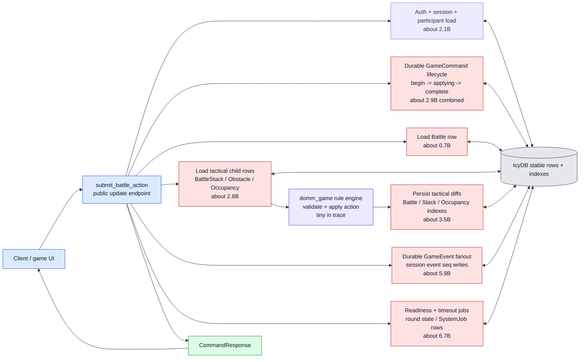
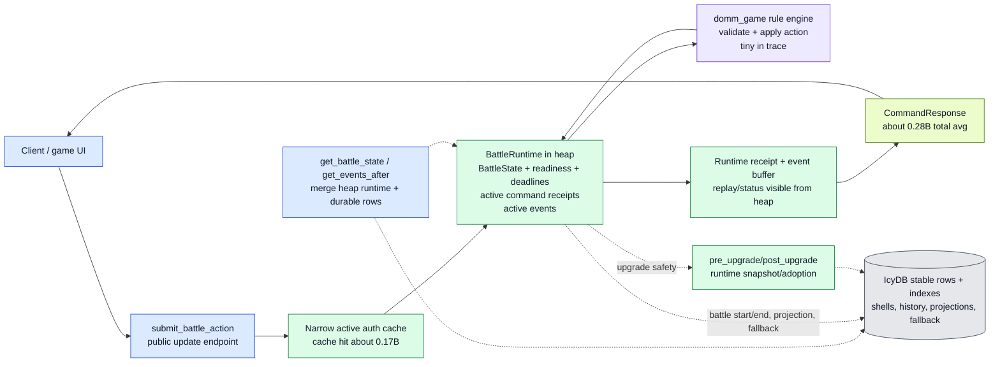
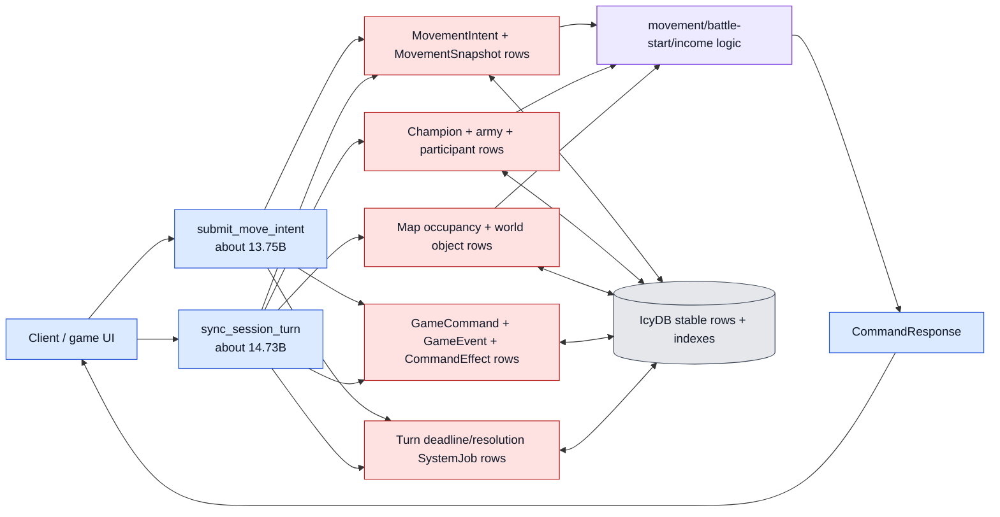
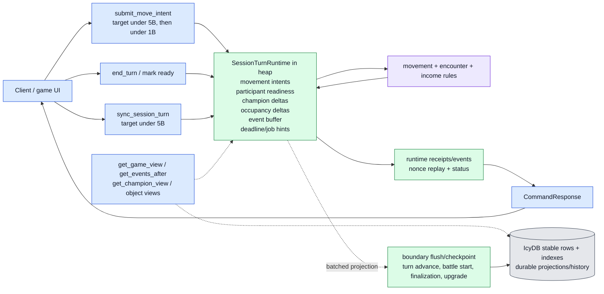

# perf1 Visual Architecture Brief

Historical note: this visual brief preserves an early perf1 snapshot. For
current measurement and status, use `perf1.measure.md`; for the completed
checklist, use `perf1.todo.md`. Sections that say "current" below refer to the
old 2026-05-19 visual snapshot, not the current 2026-05-22 runtime-kernel
state.

Goal: turn the perf1 work into an infographic that makes the architecture obvious at a glance: what was slow, what became fast, what still lives in IcyDB/stable structures, and what should move to heap runtime next.

Numbers are from the recorded perf1 benchmark artifacts and `perf1.report.md`. They are instruction averages unless noted.

## Visual Legend

Use this visual language in the final infographic:

| visual | meaning |
| --- | --- |
| Thick red arrow | Expensive stable/IcyDB row or index traffic. |
| Medium amber arrow | Moderate durable write/read or compatibility work. |
| Thin green arrow | Cheap heap/runtime mutation or in-memory response construction. |
| Blue box | Public endpoint/API boundary. |
| Green box | Heap runtime aggregate. |
| Gray cylinder | IcyDB/stable rows and indexes. |
| Purple box | Game rule engine. |
| Dotted arrow | Query/projection/read model path. |

## Before: Row-First Battle Submit

Headline metric:

| endpoint | before |
| --- | ---: |
| `submit_battle_action` combined avg | 26.9860B |
| Gate K avg | 27.4632B |
| Gate L avg | 26.5272B |
| avg memory delta | about 165 MB |

Infographic caption: every active battle action behaved like a small database transaction over many live rows. The game engine rule work was not the expensive part; stable row/index traffic was.



Arrow weight guide for the before diagram:

| heaviest arrows | why they are fat |
| --- | --- |
| `ReadyJobs <-> IcyDB` | readiness/job scheduling was the largest traced phase, about `6.7B`. |
| `Events <-> IcyDB` | durable event fanout was about `5.9B`. |
| `Persist <-> IcyDB` | tactical diff persistence was about `3.5B`. |
| `LoadState <-> IcyDB` | tactical child-row load was about `2.8B`. |
| `Command <-> IcyDB` | command begin/applying/complete/recovery was several durable row/index operations. |

The important visual point: the thick arrows loop through IcyDB many times before one command response returns.

## After: Active Battle Runtime

Headline metric:

| endpoint | after |
| --- | ---: |
| `submit_battle_action` weighted Gate K/L avg | 0.2789B |
| improvement vs pinned baseline | -98.97%, about 96.8x faster |
| Gate K avg | 0.2846B |
| Gate L avg | 0.2734B |
| avg memory delta | effectively 0 MB |

Infographic caption: active battle submit became an aggregate mutation. The endpoint now mostly touches heap runtime, calls the game engine, records a runtime receipt/event, and returns. IcyDB remains important, but it is no longer the live mutation model for each active tactical action.



Arrow weight guide for the after diagram:

| arrow | visual weight | why |
| --- | --- | --- |
| `Endpoint -> AuthCache -> Runtime` | thin/green | most calls avoid repeated stable auth/session reads. |
| `Runtime -> Engine -> Runtime` | thin/green | game-rule CPU was always tiny compared with stable IO. |
| `Runtime -> RuntimeReceipt -> Response` | thin/green | active command receipts/events are heap-visible. |
| `Runtime -> IcyDB` | dotted/medium | stable writes still happen at boundaries, fallback, projection, and finalization, not every active action. |
| `QueryMerge -> Runtime/IcyDB` | dotted/blue | queries merge active heap state with durable projections so clients see current state. |

The important visual point: the hot loop is now inside one heap aggregate. IcyDB is still present, but it is outside the per-action tactical loop.

## What Stayed In IcyDB

IcyDB is still the durable/projection/history layer. It did not become useless; it stopped being the hot live object model for active battle actions.

| stays in IcyDB/stable structures | role |
| --- | --- |
| Player, account, session, participant rows | durable identity and session membership. |
| Content/ruleset/unit definitions | durable game content lookup. |
| Battle shell/projection rows | lookup, adoption, fallback, finalization, post-battle read path. |
| Finalized battle/history/projection rows | durable history after runtime is resolved or flushed. |
| Row-backed command paths | fallback, rare paths, compatibility, non-runtime commands. |
| Public event history after flush/finalization | durable event feed and audit trail. |
| SystemJob rows | wakeup hints and recovery handles, not active tactical authority. |
| Town/champion/world rows | still mostly row-backed today; they are next candidates for aggregate treatment. |
| Benchmark metrics and repo-operation summaries | measuring changes and regressions. |

## What Moved Out Of The Hot IcyDB Loop

| moved to heap runtime for active battle | why |
| --- | --- |
| Tactical stack/occupancy/round mutation | one active aggregate is cheaper than many stable rows/indexes. |
| Active battle readiness | avoids row-ready scans/writes on every action. |
| Active battle deadlines | runtime is deadline authority; jobs are wakeup hints. |
| Active battle events | avoids durable fanout and session sequence writes per action. |
| Active battle command receipts | avoids durable command begin/applying/complete/recovery per action. |
| Active battle header state | avoids projecting `Battle.current_round`, active stack, and deadline per action. |
| Replay/status for active commands | runtime receipts serve command status before durable fallback. |

## Historical Remaining Slow Flow: Movement And Turn Sync

Headline metric after the movement cuts:

| endpoint/scenario | before movement work | 2026-05-19 recorded | change |
| --- | ---: | ---: | ---: |
| Gate J scenario instructions | 404.0368B | 357.9811B | -11.4% |
| `submit_move_intent` avg | 15.3630B | 13.7537B | -10.5% |
| `sync_session_turn` avg | 18.4665B | 14.7341B | -20.2% |

Historical infographic caption: movement improved, but it was still mostly
row-first at this point. Later perf1 work moved the route to the runtime-kernel
model; see `perf1.measure.md`.



What we already reduced in this flow:

| cut | visual effect |
| --- | --- |
| Indexed pending movement loading | one less scattered lookup shape for pending intents. |
| Fresh effect/event shortcuts | fewer stable absence checks on known-fresh rows. |
| Early not-due sync precheck | avoids durable command writes for some failed sync attempts. |
| Direct timer refresh | removes global nearest-job scans from applied turn sync. |
| Dropped redundant movement snapshot/turn effects | removes duplicated command-effect projection writes. |

The important visual point: the arrows are thinner than before, but too many of them still go through stable IcyDB on every movement/turn operation.

## Proposed Next: Active Session-Turn Runtime

This is the next architecture we should draw as the target state for movement/session-turn work.

Target caption: active turn commands should mutate one heap `SessionTurnRuntime`, then flush durable rows/projections at turn boundaries, finalization, explicit checkpoints, or upgrade. This applies the battle-runtime lesson to movement, readiness, income, map occupancy deltas, and turn jobs.



What moves to `SessionTurnRuntime` in the proposed design:

| active-turn state | current row-first smell | proposed runtime ownership |
| --- | --- | --- |
| Movement intents | durable `MovementIntent` row per fresh submit | heap intent buffer with replay receipt; durable projection later. |
| Movement snapshots | stable snapshot rows during sync | runtime step outcomes, flushed as history/checkpoint when needed. |
| Champion movement deltas | repeated champion/participant/map row updates | heap champion position/movement/resource deltas. |
| Occupancy deltas | stable map occupancy writes during resolution | heap occupancy delta map, flushed at turn boundary or battle start. |
| Turn readiness | row/job checks and status scans | runtime ready set and deadline state. |
| Command receipts | durable command rows for active-turn commands | runtime receipts first, durable archive later. |
| Public events | durable event fanout during the hot operation | runtime event buffer visible through query merge, durable flush later. |
| System jobs | repeated scans/reschedules | one wakeup hint per deadline; runtime is authority. |

What still stays in IcyDB after the proposed turn runtime:

| stable responsibility | why it stays |
| --- | --- |
| Session/player/account durability | long-lived identity and recovery. |
| Content/ruleset definitions | read-mostly durable content. |
| Turn boundary projections | clients and diagnostics still need durable snapshots. |
| Final movement history | audit/history after flush. |
| Battle-start projection handoff | battle runtime can adopt from a clean boundary or explicit battle-start projection. |
| Upgrade references/checkpoints | active runtimes must be restorable or adoptable. |
| Fallback paths | if runtime is missing, durable rows must be enough to recover or fail safely. |

## One-Screen Infographic Layout

Recommended final image layout:

```text
+----------------------------------------------------------------------------------+
| perf1: from row-first gameplay to active runtime aggregates                       |
+--------------------------------------+-------------------------------------------+
| BEFORE: SLOW ROW-FIRST BATTLE         | AFTER: FAST ACTIVE BATTLE RUNTIME         |
| submit_battle_action 26.9860B         | submit_battle_action 0.2789B              |
|                                      | 96.8x faster, -98.97% instructions        |
| Client -> Endpoint -> IcyDB loops     | Client -> Endpoint -> BattleRuntime       |
| Thick red arrows: events, readiness,  | Thin green loop: runtime -> engine         |
| tactical rows, command lifecycle      | Dotted gray: projection/fallback/history  |
+--------------------------------------+-------------------------------------------+
| CURRENT NEXT BOTTLENECK: MOVEMENT/TURN                                            |
| Gate J 404.0368B -> 357.9811B, but submit_move_intent 13.75B and sync 14.73B     |
| Still too many red arrows through MovementIntent, Snapshot, Champion, Map, Jobs    |
+----------------------------------------------------------------------------------+
| PROPOSED NEXT: SessionTurnRuntime                                                  |
| Active movement intents, readiness, champion/occupancy deltas, events, receipts    |
| stay in heap during the turn. IcyDB keeps projections, history, fallback, upgrade. |
+----------------------------------------------------------------------------------+
```

The story should read left to right:

1. Before: every action fought the stable database.
2. After: battle actions mutate one runtime aggregate and only touch IcyDB at boundaries.
3. Next: apply the same aggregate pattern to movement/session-turn, because that is now the dominant hot path.
